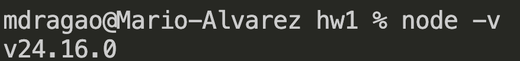
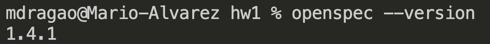
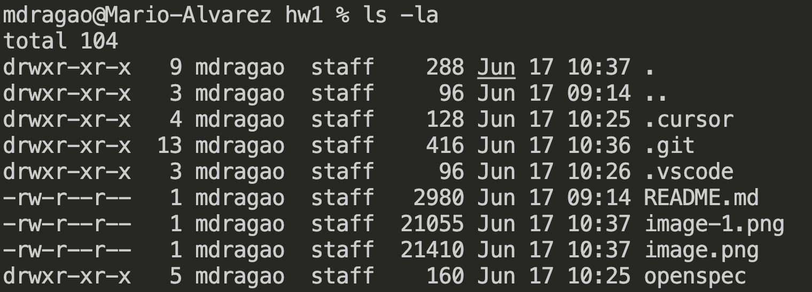
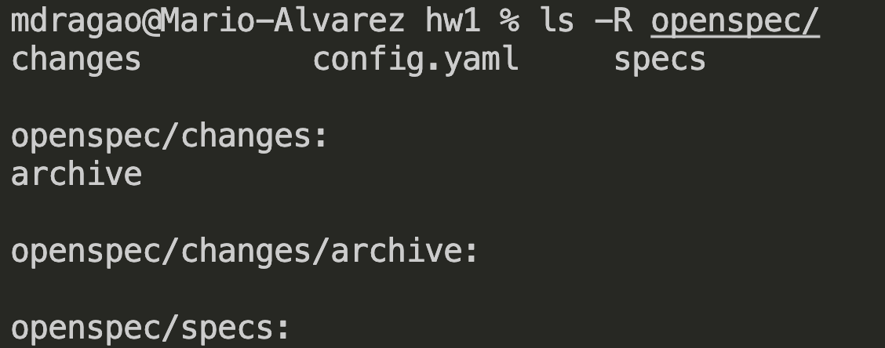

# Entregable 1

## ✅ Evidencia OpenSpec operativo

- **Node.js v20.19.0 o superior** (requisito de OpenSpec)

Verifica tu versión antes de empezar:

```bash
node --version
```



### 1. Instala la CLI de OpenSpec

```bash
npm install -g @fission-ai/openspec@latest
openspec --version   # debe responder con un número de versión
```



### 2. Inicializa OpenSpec en el sandbox

```bash
openspec init
```

En el asistente: selecciona tu copiloto (Claude Code, Cursor, Copilot…) y **acepta los defaults** del resto de prompts.

### 3. Verifica la estructura

```bash
ls -la
ls -R openspec/
```




## Micro-tarea: Generardor de contraseñas aleatorias

## Pilar 1 — Herramienta

Voy a seleccionar cursor porque por el momento voy a probar un copiloto gratis.

## Pilar 2 — Contexto

¿Qué información estás aportando?
Por el momento le pedire que sea en python y typescript, como restricciones que tiene que tener al menos 8 caracteres, que tenga numeros y caracteres especiales.
¿Hay algo del contexto que has decidido omitir conscientemente?
Si no le estoy diciendo que realice todo o pueda usar una libreria.

## Pilar 2 — Prompt

¿Cómo lo estructuras? (estilo, formato de salida, ejemplos…)

- Primero defiiniria claramente el objetivo
- Le especificaria los lenguajes
- Indicaria las restricciones de la contraseña
- Solicitaria codigo limpio
- Solicitaria pruebas unitarias
- Podir ejemplos de uso para validar

Pega aquí el prompt final que vas a lanzar.

```markdown
Actúa como un desarrollador senior.

Genera una función para crear contraseñas aleatorias en Python y TypeScript.

Requisitos funcionales:

- La contraseña debe tener una longitud mínima de 8 caracteres.
- Debe contener al menos:
  - 1 letra mayúscula
  - 1 letra minúscula
  - 1 número
  - 1 carácter especial
- La longitud debe ser configurable mediante un parámetro.
- No utilices librerías externas; usa únicamente las bibliotecas estándar de cada lenguaje.
- La función debe garantizar que siempre se cumplan los requisitos anteriores.
- Incluye comentarios explicando la lógica.

Requisitos de calidad:

- Sigue buenas prácticas de programación.
- Utiliza nombres descriptivos para variables y funciones.
- Maneja errores o parámetros inválidos de forma adecuada.
- Explica brevemente las decisiones de diseño tomadas.

Pruebas unitarias:

- Genera pruebas unitarias completas para ambas implementaciones.
- En Python utiliza unittest.
- En TypeScript utiliza Jest.
- Incluye pruebas que validen:
  - Longitud mínima.
  - Longitud personalizada.
  - Presencia de mayúsculas.
  - Presencia de minúsculas.
  - Presencia de números.
  - Presencia de caracteres especiales.
  - Manejo de parámetros inválidos.
- Explica cómo ejecutar las pruebas en cada lenguaje.

Entrega la respuesta en las siguientes secciones:

1. Implementación en Python.
2. Pruebas unitarias en Python.
3. Implementación en TypeScript.
4. Pruebas unitarias en TypeScript.
5. Instrucciones para ejecutar las pruebas.
6. Explicación de las decisiones de diseño.
```

\*Resultado:\* ¿Funcionó a la primera o tuviste que iterar?
Una mejora que harías si volvieras a hacerlo.

## 📦 Observaciones

1. Revisando de alto nivel puedo ver que los archivos generados parece que revisan el estado actual del proyecto.
2. Nos ayudan con proponer un cambio antes de modificar el proyecto, lo cual es bueno para no generar regresiones.
3. Tenemos procesos para aplicar las propuestas o incluso omitir cuando ya fue completado o cerrado.
